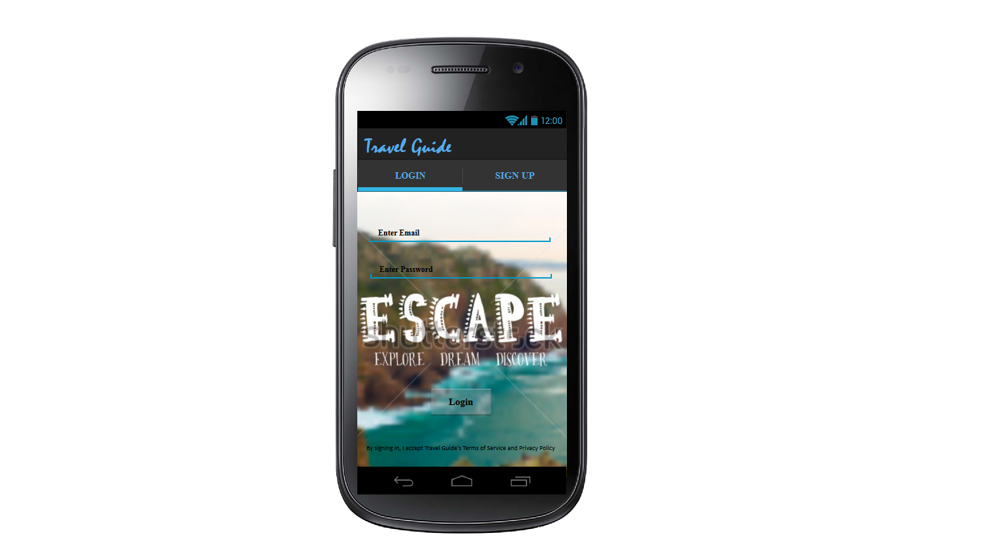
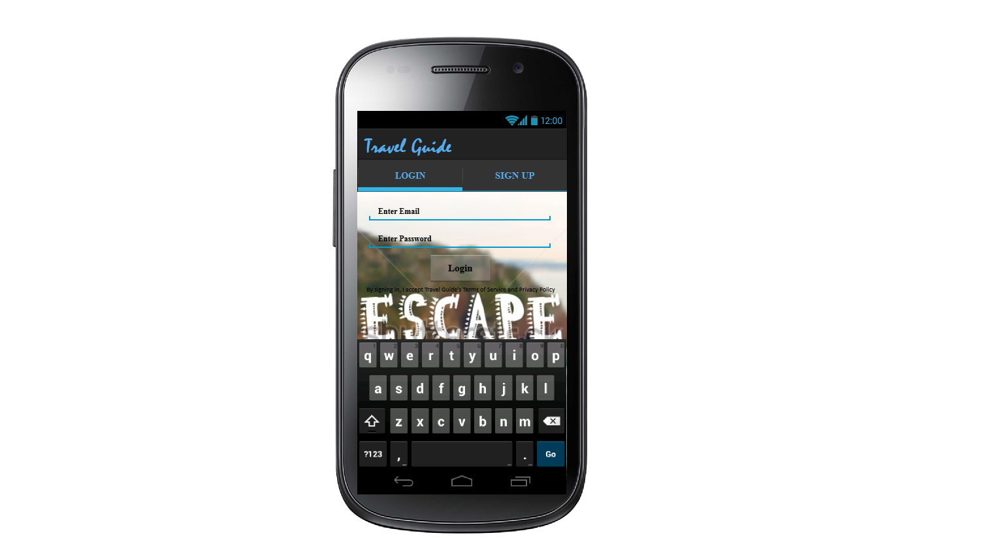
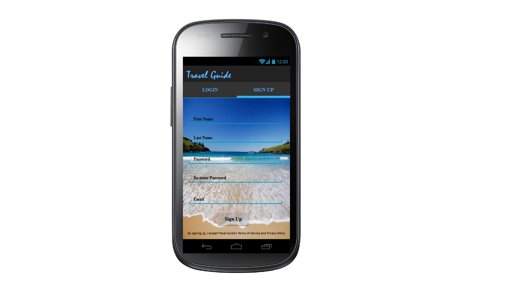
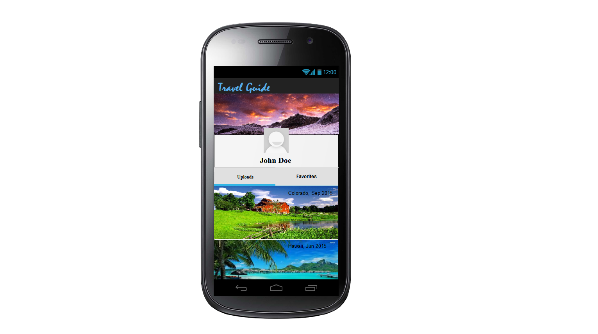
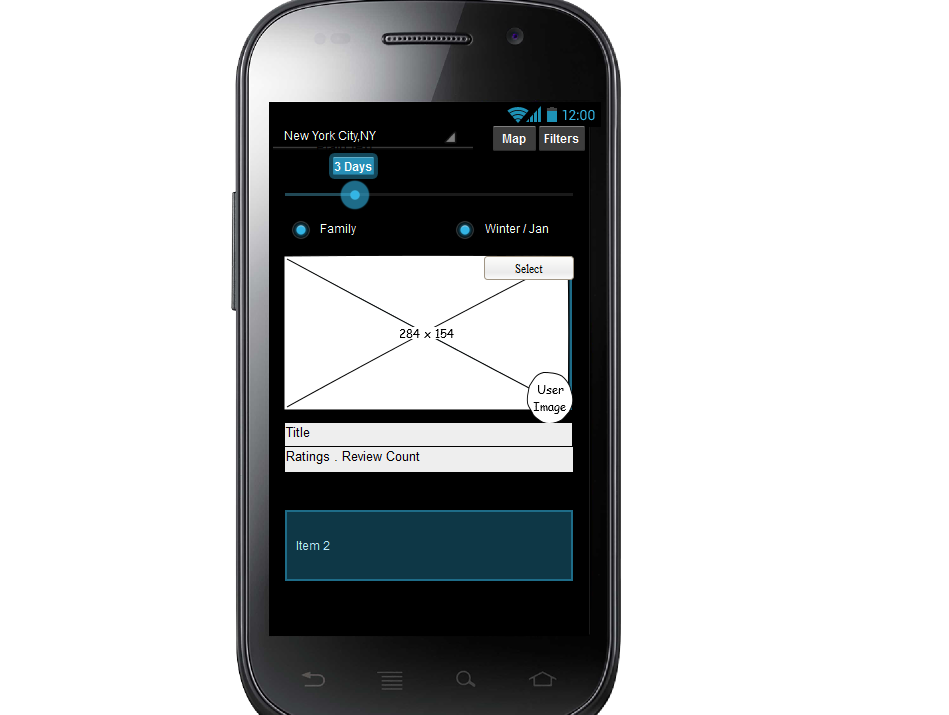
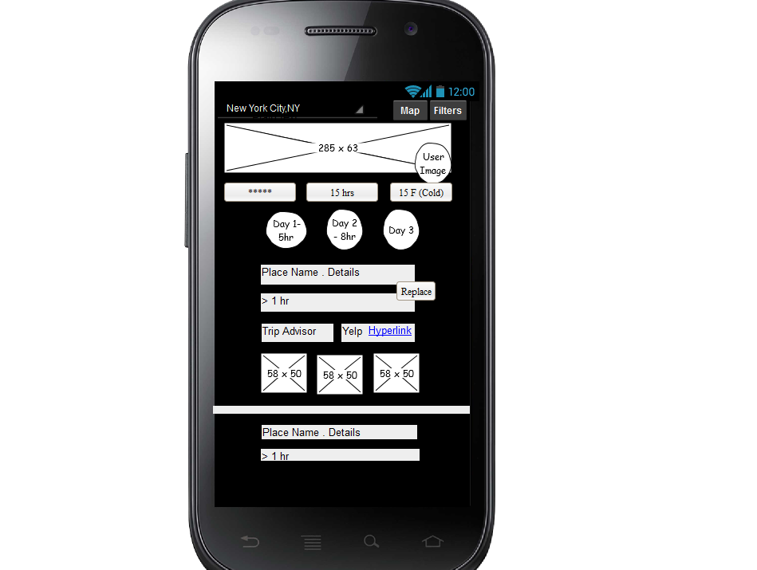

# Project  - *Travel Guide*

**Travel Guide** is an android app that allows a user to check out popular travel plans created by other travelers. It allows a user plan a trip based on preferences and crowd sourced information. The app utilizes information from travelers, Location services, photos and [Trip Advisor APIs](https://developer-tripadvisor.com/content-api/) to display information and images about tourist places across the globe.

Today, Travelers spend up to 3Hr’s crawling the web (Ex: Trip Advisor) in finding the places to visit/stay when planning for a trip. They do it because they want to tailor a plan to suit their needs/family needs so everyone can have a good time. What we can do better is - Create an app where users can create travel/trip plans from their recent trips which can be shared with other travels. By doing this travelers can spend less time in tailoring a plan and can spend more time on needed things. We will make phone UI look as simple as possible by displaying places on Map/ListView.(Here we will integrate with TripAdvisor/Yelp to pull data and we will use Phone’s features such as Camera, Persistence and Locations services)

Time spent: **X** hours spent in total

## User Stories

**ArchTypes - Login, Register and Profile - PRAVEEN**

The following **required** functionality is completed:

* [ ]	Users can sign up for a new **Travel Guide** user account
* [ ]	Users can log in to their **Travel Guide** user account
* [ ] Users are able to view their profile - Name, profile picture, recent trips
* [ ] Users can upload their trip experiences - Location, days travelled, number of people, pictures, hotel, cost etc.
* [ ] Users can view others' trip experiences
* [ ] Authentication is done using **OAuth**
* [ ] Data storage is done using **Parse**
* [ ] Data is stored for offline access in **SQLite** database and disk
* [ ] Data is retreived from local storage using ORM **Active Android**
* [ ] Data is also obtained using **[TripAdvisor APIs](https://developer-tripadvisor.com/content-api/)**
    
The following **optional** features are implemented:
* [ ] Users can add other users' trips to their **favorites**
* [ ] Users can **rate** other users' trips (upto 5 stars)
* [ ] Users can post **reviews** on other users' trips
* [ ] **Location based** information is pushed to users' phone

The following **bonus** features are implemented:

* [ ] Users can **follow** other users and get trip details on their activity feed
* [ ] Users can request a **trip plan** and the app will provide one based on available data
* [ ] **Trip recommendations** are provided based on users' preferences/past trips/favorites

The following **additional** features are implemented:
* [ ] Location based **real time data** (e.g. some event happening locally) is pushed to the users' phone

**ArchTypes - Stream and Details - HEMANTH**

The following **required** functionality is completed:
* [ ] User can **scroll** through current popular travel plans
* [ ] User can **search** for travel plans at a particular destination and/or can use phone's **location services**
* [ ] User can select and **add** any travel plan to his personal account
* [ ] For each plan displayed, user can see the following details:
 * [ ] Graphic, Caption, Username, Ratings, Time taken, Add to favorites icon
* [ ]  For each plan displayed, user can select the plan to see following details:
 * [ ] places displayed based on days/time taken to visit, photos, videos, created by user details, option to follow the plan, add/update the plan in his personal bucket, caption, username, reviews and ratings from Trip Advisor/Yelp**

The following **optional** features are implemented:
* [ ] User can **pull-to-refresh** popular stream to get the latest popular plans
* [ ] Show latest comments for each plan
* [ ] Display each user profile image using a [RoundedImageView](https://github.com/vinc3m1/RoundedImageView)
* [ ] Display a nice default placeholder graphic for each image during loading
* [ ] Improved the user interface through styling and coloring
* [ ] Allow user to view all comments for each plan using a modal overlay
* [ ] Allow images/video posts to be played in full-screen using the VideoView

## Wireframes

## Video Walkthrough 

Here's a walkthrough of implemented user stories:

http://i.imgur.com/TulmAn2.gifv

GIF created with [LiceCap](http://www.cockos.com/licecap/).

## Notes

Unable to get Refresh on Scroll Working

## Open-source libraries used

- [Android Async HTTP](https://github.com/loopj/android-async-http) - Simple asynchronous HTTP requests with JSON parsing
- [Picasso](http://square.github.io/picasso/) - Image loading and caching library for Android

## License

    Copyright [2015] kprav, SharedMocha, rafagcamargo

    Licensed under the Apache License, Version 2.0 (the "License");
    you may not use this file except in compliance with the License.
    You may obtain a copy of the License at

        http://www.apache.org/licenses/LICENSE-2.0

    Unless required by applicable law or agreed to in writing, software
    distributed under the License is distributed on an "AS IS" BASIS,
    WITHOUT WARRANTIES OR CONDITIONS OF ANY KIND, either express or implied.
    See the License for the specific language governing permissions and
    limitations under the License.
    