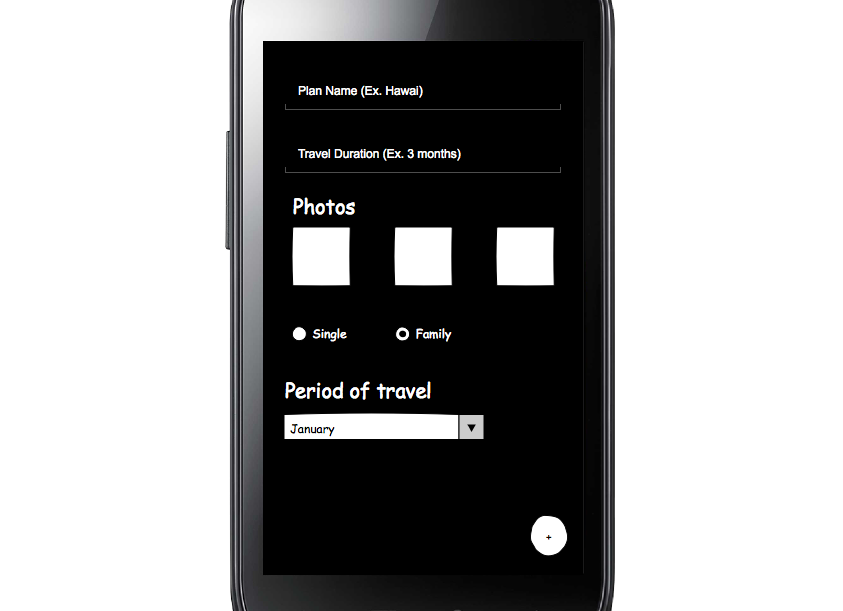

# Project  - *Travel Guide*

**Travel Guide** is an android app that allows a user to check out popular travel plans created by other travelers or create your own. It allows a user plan a trip based on preferences and crowd sourced information. The app utilizes information from travelers, location services, photos and [Trip Advisor APIs](https://developer-tripadvisor.com/content-api/)* to display information and images about tourist places across the globe.

\* Still pending of authorization from TripAdvisor they have a police that requires it.

Today, travelers spend up to three hours crawling the web (Ex: [TripAdvisor](www.tripadvisor.com)) in finding the places to visit/stay when planning for a trip. They do it because they want to tailor a plan to suit their needs/family needs so everyone can have a good time.

What we can do better is create an app where users can create travel/trip plans from their recent trips which can be shared with other travelers. By doing this travelers can spend less time in tailoring a plan and can spend more time on needed things. We will make an Android app as simple as possible by displaying places, others users plan.

In the future we could integrate with [TripAdvisor](www.tripadvisor.com) or [Yelp](www.yelp.com) to pull data. By now we're going to use Android features such as: camera, persitence and location services.

Time spent: **X** hours spent in total

## User Stories

The following **required** functionality is completed:

* [x] Users can sign up for a new **Travel Guide** user account.
* [x] Users can login to their **Travel Guide** user account.
* [x] Users should be able to view their own profile showing name, picture, your own plans.
* [x] Users can view others trip/travels plans.
* [x] Authentication is done using **Facebook/Twitter** via **Parse**.
* [x] Remote data storage is done using **Parse**.
* [x] Local data storage is done using **Parse**.
* [x] The app includes functionality for **users to search and select places**.
  * [x] User can enter place names (suggestion box) and app will fetch place names from **Parse**.
  * [Hema] The app includes functionality for users to use **Location services** to determine place name.
* [x] The app includes functionality for users to perform filters on search by city name results through in a dialog fragment.
  * [x] User can **select filters** such as travel days/length of stay, seasons, months, group type (Single, Family).
  * [x] Fetch plan details from **Parse** based on **User Details**. If no personal plans exist for user than display existed plans from others users.
  * [x] For each plan the app displayed: **graphic, caption, username, trip duration**.
* [x] For each plan displayed, user can select the plan to see following details:
  * [x] Horizontal Scrolling **list of days, option to follow the plan, option to share the plan**.
* [x] Display each user profile image using a **RoundedImageView**.
* [x] Create a new travel plan: name, travel duration, picture of places, travel type (Single/Group), month of visit (January, February).
  * [x] Inside travel plan creation user can click to add more days to the trip, will show a dialog to fill following fields: **place name, visit duration, description**.
    
The following **optional** features are implemented:

* [Praveen] User can scroll (infinite) through **travel plans at a particular location**.
* [Praveen] Added Foursquare API for fetch places.
* [Hemman] Users can add other users' trips to their **favorites**.
* [Rafael] Clicking on the day to edit **place name, visit duration**.
* [ ] Users can **rate** other users' trips (up to 5 stars).
* [ ] Users can post **reviews** on other users' trips.
* [ ] **Location based** information is pushed to users' phone.
* [ ] For plans that are added to user personal list:
  * [ ] He/She Can Update **(Add/Remove/Edit) places or details or photos**
  * [ ] Publish his new plan to **Parse**
  * [ ] **Add friends to plan**
  * [ ] View his published plan **reviews and ratings** by other users
* [ ] User can **pull-to-refresh** popular stream to get the latest popular plans
* [ ] Show **latest comments** for each plan and place in **modal overlay**
* [ ] Allow images/video posts to be played in full-screen using the **VideoView**
* [ ] Show Places on **Map**
* [ ] If filters exist then save them to **Shared Preferences** and use them for future searches
* [ ] On click of each date we display **video, weather details**

The following **bonus** features are implemented:

* [ ] Users can **follow** other users and get trip details on their activity feed.
* [ ] Users can request a **trip plan** and the app will provide one based on available data.
* [ ] **Trip recommendations** are provided based on users' preferences/past trips/favorites.
* [ ] Data is also obtained using **[TripAdvisor APIs](https://developer-tripadvisor.com/content-api/)**.
* [ ] Pull images of places from google image to add photos on creation plan.
* [ ] Location based **real time data** (e.g. some event happening locally) is pushed to the users' phone.

## Wireframes

## Video Walkthrough 

Here's a walkthrough of implemented user stories:

GIF created with [LiceCap](http://www.cockos.com/licecap/).

## Notes

Describe any challenges encountered while building the app.

## Open-source libraries used

- [Android Async HTTP](https://github.com/loopj/android-async-http) - Simple asynchronous HTTP requests with JSON parsing
- [Picasso](http://square.github.io/picasso/) - Image loading and caching library for Android

## License

    Copyright 2015 Praveen Kannan, Praveen Kannan, Rafael Camargo

    Licensed under the Apache License, Version 2.0 (the "License");
    you may not use this file except in compliance with the License.
    You may obtain a copy of the License at

        http://www.apache.org/licenses/LICENSE-2.0

    Unless required by applicable law or agreed to in writing, software
    distributed under the License is distributed on an "AS IS" BASIS,
    WITHOUT WARRANTIES OR CONDITIONS OF ANY KIND, either express or implied.
    See the License for the specific language governing permissions and
    limitations under the License.
    
